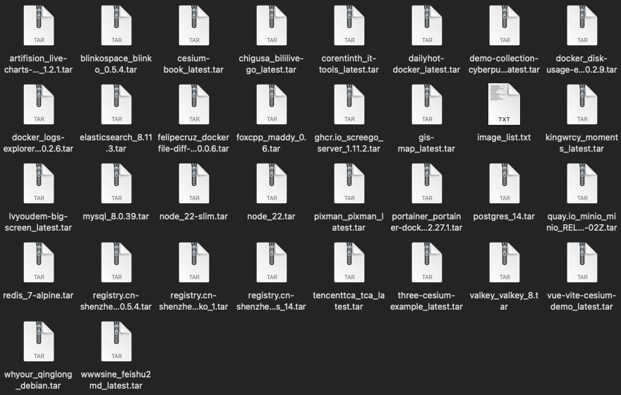

# Docker Container Backup and Restore Tool



This tool includes two main scripts: `backup-images.sh` and `restore-images.sh`, designed to simplify the process of backing up and restoring Docker containers along with their environment variables and images.

## Script Descriptions

### backup-images.sh

#### Purpose
The `backup-images.sh` script is used for backing up configuration information (including startup parameters, environment variables, etc.) of all currently running Docker containers in the system, as well as the names and tags of the images they use. The backup file will be compressed into a `.tar.gz` format for easy storage and transfer.

#### Usage
1. **Grant Execution Permission**: First, you need to grant execution permission to the script.
   ```bash
   chmod +x backup-images.sh
   ```
2. **Run the Script**: Simply run the script to start the backup.
   ```bash
   ./backup-images.sh
   ```
3. **Result**: The script will generate a compressed package named with a timestamp in the current directory, e.g., `container_backup_20250310_004541.tar.gz`.

### restore-images.sh

#### Purpose
The `restore-images.sh` script is used to restore Docker containers and their configurations from a backup file created by `backup-images.sh`. It recreates the containers and applies the original configurations, including environment variables, port mappings, and volume mounts.

#### Usage
1. **Grant Execution Permission**: Similarly, grant execution permission to the script.
   ```bash
   chmod +x restore-images.sh
   ```
2. **Run the Script**: Specify the path of the backup file you want to restore when running the script.
   ```bash
   ./restore-images.sh container_backup_20250310_004541.tar.gz
   ```
3. **Note**: Ensure that all required images are present in your Docker environment before running the restore script. If some images are missing, the script will notify you to load these images.

## Notes
- Ensure there is enough disk space before performing backup or restore operations.
- If your containers depend on specific versions of images, make sure these images are available locally or download them in advance before restoration.
